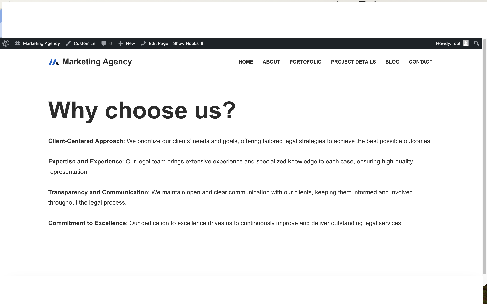

# FamilyConsultSite

A website designed for family and law consultation where it is    presented as  a template,  with features such as:

1 - host being able to use the database manually, or by sqlite database

# Usage of sqlite interface
```
make 
./interface
```


# Giving explicit statement to sqlite DBMS 

```
./interface --auto
```


# How to use Mysql python interface

```
python3 -m pip install -r requirements.txt
python3 sqlhandler.py
```


# Screenshots 



